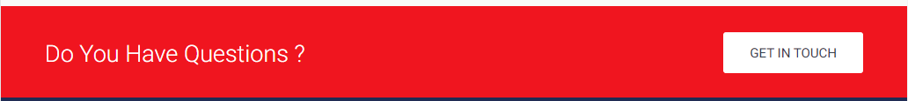
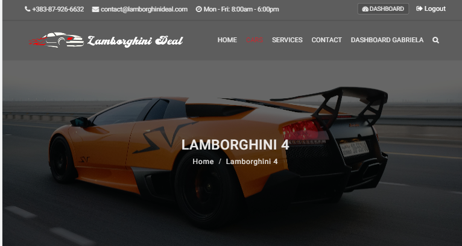
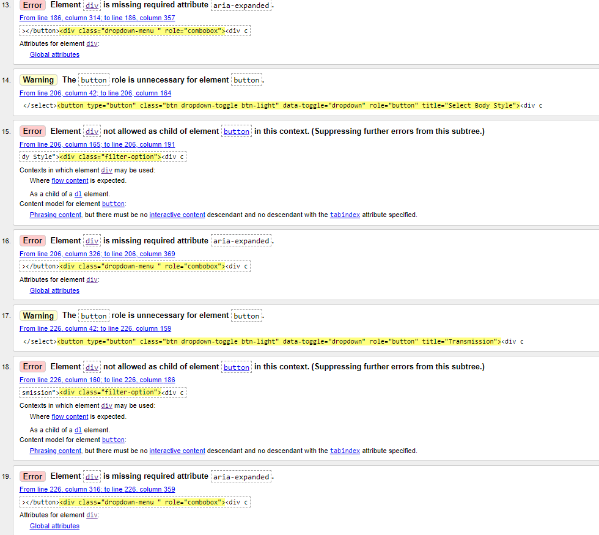
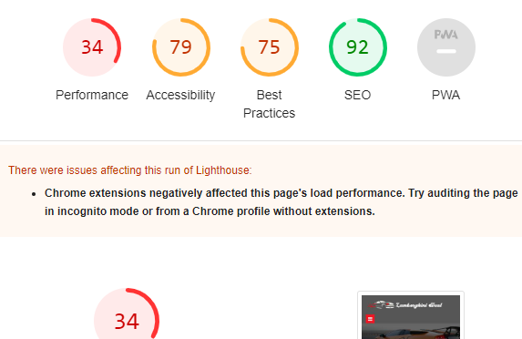

## Project 4

# LamborghiniDeal

The Project is deployed [here](https://lamborghini-deals.herokuapp.com/) 

GitHub repository is [here](https://github.com/fitabigail/Lamborghini-Deals) 

## TABLE OF CONTENTS
- [Aim of the website](#aim-of-the-website)
- [User Experience/User Interface](#user-experience-or-user-interface)
- [Flowchart](#flowchart)
- [Design](#design)
- [Features](#features)
- [Database](#database)
- [Testing](#testing)
- [Validation](#validation)
- [LightHouse](#lighthouse)
- [Technologies Used](#technologies-used)
- [Deployment](#deployment) 
- [Credits](#credits)
- [Acknowledgement](#acknowledgement)

  

> ## Aim of the website
---
 
LamborghiniDeal is a website for selling second-hand Lamborghini. The user can quickly search for a specific car model, through the search bar on home page, or by more specific fields on the cars page. Also, the user can navigate on displayed cars, and choose a car post to have more details about. Once a car post is chosen the user can request more information by completing an inquiry form. To request more details about a car the user must be registered on the website. He can see his inquiries on the user dashboard, and update or delete the inquiry.  Options for selling a car are not available at the minute. But this would be a future feature where users can sell as well.   

> ## User Experience or User Interface
---
 

### Agile
The plan for this project was carried out using the Agile Methodology in Github. User Stories were created using the issues on the git hub. Each user story explicitly explains the purpose of the issues. Each user story is segmented into acceptance criteria and tasks. It was prioritised using GitHub labels with different colors. The labels are should have, could have and must have. Once the issues are created they are moved to the User Stories kanban board. The Kanban board has three main columns, To Do, In Progress and Done. Once you start working with the user story, you move it to the To Do column and when finished move it to the Done column. Following this pattern of work gives you a full-on idea about the progress of the project.  

### Epic
  
The epics were created using the milistones on github. Each epic was created and related issues were added to it. There are four epics - 

- EPIC : CRUD Functionalities

    - USER STORY: Inquiry Add [[#13](https://github.com/fitabigail/Lamborghini-Deals/issues/13)]
    - USER STORY: View Inquiried [[#8](https://github.com/fitabigail/Lamborghini-Deals/issues/8)]
    - USER STORY: Update my Inquiry[[#10](https://github.com/fitabigail/Lamborghini-Deals/issues/10)]
    - USER STORY: Delete my Inquiry [[#12](https://github.com/fitabigail/Lamborghini-Deals/issues/12)]
    
    

- EPIC : Register & Login and Logout

    - USER STORY: Sign up [[#15](https://github.com/fitabigail/Lamborghini-Deals/issues/15)]
    - USER STORY: Register Account [[#4](https://github.com/fitabigail/Lamborghini-Deals/issues/4)]
    - USER STORY: Login and Logout [[#16](https://github.com/fitabigail/Lamborghini-Deals/issues/16)]

- Epic: Enable user interaction by providing site pagination, search, contact form, see the team 
    
    - USER STORY: Search car [[#17](https://github.com/fitabigail/Lamborghini-Deals/issues/17)]
    - USER STORY: Search car details [[#19](https://github.com/fitabigail/Lamborghini-Deals/issues/19)]
    - USER STORY: Site Pagination  [[#18](https://github.com/fitabigail/Lamborghini-Deals/issues/18)]
    - USER STORY: Contact us form [[#14](https://github.com/fitabigail/Lamborghini-Deals/issues/14)]
    - USER STORY: Team  [[#1](https://github.com/fitabigail/Lamborghini-Deals/issues/1)]

### Product Backlog 

- LamborghiniDeals Product Backlog

    - USER STORY: Forgot Password  [[#20](https://github.com/fitabigail/Lamborghini-Deals/issues/20)]
    - USER STORY: Like a post [[#7](https://github.com/fitabigail/Lamborghini-Deals/issues/7)]
    - USER STORY: Login with Google  [[#22](https://github.com/shahid129/mycar/issues/22)]
    - USER STORY: Login with Facebook  [[#21](https://github.com/fitabigail/Lamborghini-Deals/issues/21)]

### User Stories

User Story Detailed

  
- Site Pagination
    - As a **Site User** I can view a paginated list of posts so that **I can select the post I want to view**. (must have / complete) [[#18](https://github.com/fitabigail/Lamborghini-Deals/issues/18)]
    
- Login and Logout 

    - As a **Site User**, I can log in and Logout from my account so that **I can not request details about a car and like a post**. (must have / complete) [[#16](https://github.com/fitabigail/Lamborghini-Deals/issues/16)]

- Search Car Details
    - As a **Site User** I can search for the cars I want so that **I can click on each car to view car details**.(must have / complete) [[#19](https://github.com/fitabigail/Lamborghini-Deals/issues/19)]

- Search Car
    - As a **Site User**, I can search for a specific car so that **I can look only for the cars I am interested**. (must have / complete) [[#17](https://github.com/fitabigail/Lamborghini-Deals/issues/17)]
    
- Sing up 

    - As a **Site User**, I can sign up for an account so that **I can request details about a car and like a post**. (must have / complete) [[#15](https://github.com/fitabigail/Lamborghini-Deals/issues/15)]

- Add Contact us Form
    - As a **Site User/Admin**, I can get in touch with the site owner so that **I can complete the contact form to send a message**.(must have / complete) [[#14](https://github.com/fitabigail/Lamborghini-Deals/issues/14)]

- Add new inquiry
    - As a **Site User**, I can add new inquiries on my dashboard so that **I can look for a new car and request details about it**.(must have / complete) [[#13](https://github.com/fitabigail/Lamborghini-Deals/issues/13)]

- Delete Inquiry
    - As a **Site User/Admin**, I can delete my inquiry on my dashboard so **I can remove the car inquiry in which I am not interested anymore**. (must have / complete) [[#12](https://github.com/fitabigail/Lamborghini-Deals/issues/12)]
    
- Update Inquiry 
    - As a **Site User**, I can edit my inquiry on my dashboard so that **I can update the inquiry**. (must have / complete) [[#10](https://github.com/fitabigail/Lamborghini-Deals/issues/10)]

- View Inquiery
    - As a **Site User/Admin**, I can view my inquiry on my dashboard so that **I can read, update, or delete the inquiry**.(must have / complete) [[#9](https://github.com/fitabigail/Lamborghini-Deals/issues/9)]

 - View request message
    - As a **Site User / Admin** I can view request messages on an individual post so that **I can read the request**.(duplicate / complete) [[#8](https://github.com/fitabigail/Lamborghini-Deals/issues/8)]

- View likes
    - As a **Site User / Admin** I can view the number of likes on each post so that **I can see which is the most popular or viral**.(should have / complete) [[#7](https://github.com/fitabigail/Lamborghini-Deals/issues/7)]
    
- Open a post

    - As a **Site User** I can click on a post so that **I can read the full text**. (must have / complete) [[#6](https://github.com/fitabigail/Lamborghini-Deals/issues/6)]

- View post list
    - As a **Site User** I can view a list of posts so that **I can select one to read**.(must have / complete) [[#5](https://github.com/fitabigail/Lamborghini-Deals/issues/5)]

- Account registration
    - As a **Admin** I can **see register account** so that **I can delete if I want**.(must have / complete) [[#7](https://github.com/fitabigail/Lamborghini-Deals/issues/7)]
    
- Manage posts

    - As a **Site Admin** I can create, read, update, and delete posts so that **I can manage my site content**. (must have / complete) [[#3](https://github.com/fitabigail/Lamborghini-Deals/issues/3)]

- Add Team mebmber
    - As an **Admin** I can create, update, and delete a team member's profile so that the user **can see the team member profile online**.(must have / complete) [[#1](https://github.com/fitabigail/Lamborghini-Deals/issues/1)]  

      
   
   

> ## Flowchart
---

 

  

> ## Design
---
 

The main purpose of the template choosed is to be build an website suitable for a car dealer easy to be remembered. LamorghiniDeal is built with the Bootstrap 5 framework (version: v4.0.0) has some jQuery plugin to give a nice look and functionality. The template use Google Font: **Open Sans** and **Playfair Display**, Font Awesome Icon to make the template. Red skin colors  **#dc141d** and **#f0151f**. You must have to keep all these dependencies if you wish the template work same to you as preview.

Animate CSS
Google Fonts
Jquery
Query Plugins
Bootstrap Select
Bootstrap Sub-menu
jQuery ScrollUp
jQuery mCustomScrollbar
jQuery Range Slider
jQuery YTPlayer
jQuery Easing
jQuery Filterizr
jQuery Dropzone
jQuery Magnific Popup
jQuery Leaflet
jQuery Types.js
Font Awesome

  

> ## Features
---
 
The main objective of this project was to allow the users to have CRUD functionalities. The user can create an account where all his inquiries for individual car can be seen and not only they can update and delete any inquiry made by them. In addition the users have the option to search for the cars they are interested by main search bar and the search module which includes more searching options. The main pages of the website are Home, Cars, Services, Contact Us, Login, Singnup and registered user Dashboard. The admin pannel was customized with company logo.
Template of website is a boostrap template  [Carhouse](https://www.udemy.com/course/python-django-real-project-for-freshers-freelancers) customized for the website purpose.
  

  

* ## Top bar
The top bar includes contact information and links to Login / Sing Up when the user is not logged in and Dashboard / Logout. The topbar on big screens desktops and laptops on scrolling down the page are hidden, and for smaller devices is not displayed. The top bar is repeating on all the pages.

 

* ## Navbar
 
Navbar includes links to the website pages and has two views. One is for bigger screens and one collapses for smaller screens. Besides on Navbar in Logo which is visible on all sizes of screens. Navbar is on all pages.
<ol>
<li>

### Navbar on screens

</li>

<li>

### Logo

The website Logo is customized with the name of the website "LamborghiniDeals" and is linked with the home page. On the website are used a white and black logo, to be better seen on black and white background. The switch on the top page was enabled with javascript. </li>

<li>

### Search
 User can search from a particular car model straigth from the search icon from navbar. Effect achived with javascript.</li>

</ol>
  

* ##  Home Page
<ol>
<li>

### Carousel
On the home page, the banner section has a three-sliding car images carousel with a message and a link button to redirect the user to the Car page where the cars are listed.</li>

<li>

### Latests Cars
The latest car section shows the cars on slick slide staiting with the latest added. From here the user can easy to click on the car he like and see more details about it.</li>

<li>

### Team Executive
The pictures of the team are displayed with social links for contact, name and position heald on the company.

</li>

<li>

### Question 

In this section, the user can ask for more information by accessing the contact page by clicking  GET IN TOUCH button.

</li>
<li>

### Footer
The footer is simple and include social media links.

</li>
</ol>
 

* ## Cars Page
<ol>
<li>

### Car banner 

The banner has a display message, show what page you are and has a link to the Home page.

</li>
<li>

### Car List

The cars are displayed four by page and paginated. By clicking an individual car the user will be redirected to to car details page.

</li>
<li>

### Search Car List

The user can use the car fillter from search fileds by model, location, body style, transmision and price. From Search list the user is redirected to Search Car page. On Search page the user can redifine his car search options.

</li>
</ol>
  

* ## Car Details Page

<ol>

<li>

### Car Details Banner

</li>
<li>

### Car details

On car details are all basic information about the car with the chance to Ask For More information by open the Inquiry modal.

</li>

<li>

### Car modal inquiry

The user can fill out the inquiry form to ask for more details about what is interesting. After he completes the inquiry and sends it, the user is redirected to the Dashboard

</li>
</ol>
  

* ## Dasboard Page

On the dashboard page, the registered user has the chance to see their inquiries and review, update, and delete the inquiry.
<ol>
<li>

### Registred User

</li>
<li>

### Unregistred User

</li>
</ol>
  

* ## Sing up and Log In Page
<ol>
<li>

### Sing up 

</li>
<li>

### Log In

</li>
</ol>
  

* ### Services Page
Displays described services that the company can offer to their buyers.

  

* ### Contact Us Page

The user can be sent messages to the website owner by filling out a Contact form.

  

  

* ## Future Features

The website offers the basics for searching and buying a car. For future I think to add more of then to gain a better  place on the market. The futures what I want to be added are listed below:

* Create a option to for a registred user to sell a car trough website;
* Create a forgot pasword option for users;
* A live chat facilitating user interaction on real time;
* A label to show which car are reserved or sold;
* A car renting option for special ocassions;
* A user profile.

  

> ## Database
---
 

* ### Data Model and Database Host
 
There are four data models in this project. Car Model, EnquiryForm Model, Contact Model and a Team Model. Team model and Car model has a one-to-many relationship, as well Car model has OneToMany one-to-many relationship with EnquiryForm model.
  

<ol>
<li>

### Data Model - Schema

</li>
 
<li>

### Database Host

- [ElephantSQL](https://www.elephantsql.com/)  
   Documentation for setting a database [here](https://www.elephantsql.com/docs/).
   </li>
   </ol>
   

  

> ## Testing
---
 

 ## Top bar
 

| Feature   	| Expected Action   	| Result   	|
|---	|---	|---	|
|Address and contact| Land Contact page| Pass|
|Login button| Land Login Page| Pass|
|Sing Up button| Land Sing Up page| Pass|
|Dashboard| Land Dashboard page| Pass|
|Logout| Log out the user| Pass|
 

## Navbar
 

| Feature   	| Expected Action   	| Result   	|
|---	|---	|---	|
|Logo|Land Home page| Pass|
|Home|Land Home page| Pass|
|Cars|Land Cars page| Pass|
|Services|Land Services| Pass|
|Contact|Land Contact page|Pass|
|Search icon|Open the search bar| Pass|
 

## Home
 

| Feature   	| Expected Action   	| Result   	|
|---	|---	|---	|
|Caroussel Slide Arow|Swich to next image| Pass|
|Caroussel Button|Land Car page| Pass|
|Latest Cars Arow|Slick to next car| Pass|
|Lates Car Item|Land Car Details page| Pass|
|Sale label, Miles, Year, Transmission and Car Title|Land Car Details page| Pass|
|Team social accounts|Land Facebook and Twitter page| Pass|
|Questions button|Land Contact page|Pass|
|Scroll up button| Scroll up the page | Pass|
 

## Footer
 

| Feature   	| Expected Action   	| Result   	|
|---	|---	|---	|
|Social links|Land social pages| Pass|

 

## Cars
 

| Feature   	| Expected Action   	| Result   	|
|---	|---	|---	|
|Banner home link|Load Home page| Pass|
|Car item| Load Car Details| Pass|
|Page no and arows| Flip between pages| Pass|
|Search by model| Show model| Pass|
|Search by location| Shows cars on same location| Pass|
|Search model by year| Shows cars on same year| Pass|
|Search model by body style| Shows cars on same body style| Pass|
|Search model by transmision| Shows cars on same transmision| Pass|
|Search model by price| Shows cars on same price| Pass|
|Social links| Open new social page| Pass|

 

 

## Search page
 

| Feature   	| Expected Action   	| Result   	|
|---	|---	|---	|
|Banner home link|Load Home page| Pass|
|Search by model| Show model| Pass|
|Search by location| Shows cars on same location| Pass|
|Search model by year| Shows cars on same year| Pass|
|Search model by body style| Shows cars on same body style| Pass|
|Search model by transmision| Shows cars on same transmision| Pass|
|Search model by price| Shows cars on same price| Pass|
|Social links| Open new social page| Pass|

 

## Service
 

| Feature   	| Expected Action   	| Result   	|
|---	|---	|---	|
|Banner home link|Load Home page| Pass|

 

## Contact
 

| Feature   	| Expected Action   	| Result   	|
|---	|---	|---	|
|Banner home link|Load Home page| Pass|
|Contact form button|Submit the form and show  success message| Pass|
|Required fields| No empty fields| Pass|

 

## Login
 

| Feature   	| Expected Action   	| Result   	|
|---	|---	|---	|
|User field| Accept user| Pass|
|Password field| Accept password|Pass|
|Wrong User|Error message|Pass|
|Wrong password|Error message|Pass|

 

## Dashboard
 

| Feature   	| Expected Action   	| Result   	|
|---	|---	|---	|
|Add Inquiry button|Load Cars page| Pass|
|View Car button|Load Car Details page| Pass|
| Update button|Load update form| Pass|
|Delete button|Delete the inquiry|Pass|

 

## Update
 

| Feature   	| Expected Action   	| Result   	|
|---	|---	|---	|
|Update button|Submit updated inquiry| Pass|

 

## Sing UP
 

| Feature   	| Expected Action   	| Result   	|
|---	|---	|---	|
|Field required|No empty field| Pass|
|Email field|email format input| Pass|
|Password match| Message pasword not match| Pass|
|Register button|Submit the new user| Pass|
|Login here| Load login page|Pass|

## Messagess
 

| Feature   	| Expected Action   	| Result   	|
|---	|---	|---	|
|All messages|Display on designated place| Pass|
|Javascript for messages| Messages fadeout| Fail|
  

## **BUGS**
 
### Fixed bugs

- The home page banner was not responsive I fixed the issue with .img-fluid bootstrap class, and on small screens  than 992px will display:none.
- The server was give me error 500 as fonts was not supported on static folder. So I delete the fonts folder, and I linked a cdn link for Fontawsome on the head.
- The table on dashboard was not show he numbers of inquiries I fixed by adding css style for content counter.
- The table was not responsive I fixed with .table-responsive bootstrap class.

  
### Not Fixed bugs

So far I have knwoldge of this bugs:
- The search fields shows duplicate options.
- The contact form it is not working properly. If the same code is written again and refresh the page the contact form is working properly an a contact form is registred on contact model on admin page. I did research, asked student support but at this stage I can  not figured out what can cause this issue. 
- Messages should fade out but their are not removed until the page refresh. Was worked at begain but not anymore.
- The template of page 404 is on top of django. 
 

  

  

  

> ## Validation
---
 

 

> HTML

### Home

Has 3 Errors: 

* First two are related to the head, as dynamic code was used to display the head. 

### Cars

Has 18 Errors I could not figured out on my code: 

### Services

Has 2 Errors : 

### Contact

Has 2 Errors : 

### Dashboard

Has 2 Errors : 

### Login

Has 1 Errors : 

### Sing Up

Has 2 Errors : 

### Update inquiery

Has 2 Errors : 

### Search page

Has 19 Errors : 

### Update inquiery

Has 2 Errors : 

> CSS

Has 2 Errors:

> Javascript

Has 2 Errors:

> Python

Python has  lines mark as too long  white space trail but because I was under time pressure I left to fix them in the future.

* Laborghini_deals

* Laborghini

* EnquiryForm

* Cars_views

  

> ## LightHouse
---

 
The lighthouse score had come a bit low, it is pointing out of the image formats, that have not been set for the web, about the bootstraps cdn, compression and reduce amount of the unneccesary code, since this was one of the last steps done in the project I have not had the time for look for guidance on this matter, but it will be address in the future.  

### Home

### Cars

### Services

### Contact

### Dashboard

### Update

### Sing Up

### Car Details

  

> ## Technologies Used

 

### Languages

- [HTML](https://html.com/)

- [CSS](https://www.w3.org/Style/CSS/)

- [Python](https://www.python.org/)

- [JavaScript](https://www.javascript.com/)
  

## Frameworks and Libraries

- [Django](https://www.djangoproject.com/)
Documentation for [here](https://docs.djangoproject.com/en/4.1/intro/)

- [Summernote](https://summernote.org/) 

- [Jquery](https://jquery.com/) 

- [Boostrap](https://getbootstrap.com/)

- [Gunicorn](https://gunicorn.org/)

- [Cloudinary](https://cloudinary.com/) 

- [psycopg2](https://www.psycopg.org/docs/)
  

### Other Technologies

- [Gitpod](https://www.gitpod.io/) - as the IDE
- [Github](https://github.com/) - to store code in the repository
- [Heroku](https://www.heroku.com/) - to deploy on a cloud based platform
- [Google Fonts](https://fonts.google.com/)- for the fonts
- [Draw.io](https://app.diagrams.net/)- for flowchart and database
- [Fontawesome](https://fontawesome.com/) - for icons
- [Favicon](https://favicon.io/) - to create the favicon
- [Compressor](https://compressor.io/) - to compress the image
- [W3C Markup Validation Service](https://validator.w3.org/) - to validate html
- [W3C CSS Validation Service](https://jigsaw.w3.org/css-validator/) - to validate css
- [PEP8](https://peps.python.org/pep-0008/) - to validate python code
  

  

> ## Deployment
---
 
This project was use Heroku service for deployment. The folowing steps have to be done:
  

<ol>
<li>Log in Github.</li>
<li>Open the repo to deploy.</li>
<li>Log in Heroku.</li>
<li>Click in the "New" button in the top right.</li>
<li>Select "Create New App"</li>
<li>Give a name to the App and choose a region.</li>
<li>Click in "Create App" button.</li>
<li>Click in Settings.</li>
<li>Click in Reveal Config.</li>
<li>Add Vars Config (keys):</li>
<ol>
<li>Cloudinary (Media Storage)</li>
<li>DataBase Elephant (DataBase Host)</li>
<li>PORT 8000</li></ol>
<li>Django (Framework)</li>
<ol>
<li>Go to Deploy in the nav bar. In Deploment Method, select GitHub/Connect to GitHub.</li>
<li>In Connect to GitHub, write the repository name and click in search.</li>
<li>Once the route for the repo appears under the search, click in "Connect" button.</li>
<li>The deployment can be Manual or Automatic, select the one of your preference. Automatic has the advantage of updating your deployed site as you push the commit in GitHub.</li>
<li>Verify that "Branch to deploy" is master/main.</li>
<li>Click Deploy.</li>
</ol>
</ol>
  

**Steps to use this repository**:

- Access to the repo in GitHub [here](https://github.com/fitabigail/Lamborghini-Deals).
- It can be "Fork" following the steps [here](https://docs.github.com/en/get-started/quickstart/fork-a-repo).
- It can be "Clone" following the steps [here](https://docs.github.com/en/repositories/creating-and-managing-repositories/cloning-a-repository#cloning-a-repository).

  

> ## Credits

The idea of a car dealer website came from my littel boy which loves Lamborghini cars. On my research I found this tutorial: [Build Python Django Real Project](https://www.udemy.com/course/python-django-real-project-for-freshers-freelancers) on [Udemy](https://www.udemy.com/) and I decide to follow and adapt it to my needs. The template is great, but now I think I worked more than if I was build my self. Now I understand the work of tutors who must dig  on our code to find the errors.

- The images for this project was taken from [Pexels](https://www.pexels.com/) for team pictures I used the template images.

- The text for banner I used from the theme template, and all the rest I have research on simlar cars dealers websites. 

- The Favicon for this project was made from [Favicon](https://favicon.io/favicon-generator/)

- The Icons for this project was taken from [Font Awesome](https://fontawesome.com/)

- The Font for this project was taken from [Google Fonts](https://fonts.google.com/)

- Image was compressed by [compressor](https://compressor.io/)

- Google was used to search for ideas about how to use code, but any major help taken is stated in the block of code

- To better understand the code and a lot of help was taken from

    - [Django documents](https://docs.djangoproject.com/en/4.1/)
    - [Stack Overflow](https://stackoverflow.com/)
    - [Udemy](https://www.udemy.com/course/python-django-real-project-for-freshers-freelancers) - Build Python Django Real Project: Django Web Development tutorial
    - [Codemy](https://www.youtube.com/@Codemycom)
    - [CarHouse Template](https://themeforest.net/item/car-house-car-dealer-template) - my template

> ## Acknowledgement

I want to express my gratitude to tutors from student tutor, and my mentor Ronan, for their continual support and advice. The Icetb-may-2022 slack group.

### Thank You

I want to express my gratitude to my husbant in particular for patience and support to finish the projects.

